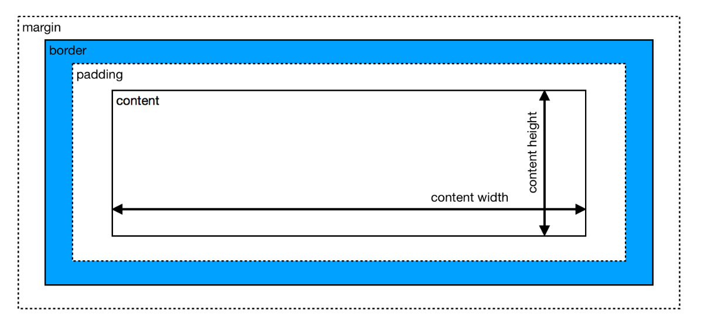

## CSS Notes

### Linking CSS with HTML
There are three ways to add CSS to the HTML code.

### Inline CSS
CSS is said to be added ‘inline’ when it is used in the style attribute of HTML tags. This is inefficient and not scalable because each individual tag would have to have the CSS inserted. This method is generally never used as it is extremely impractical.
```
<h3 style ="color:blue">Blue Heading!</h3>
```

### Internal CSS
You can use <style> tags within the <head> of the HTML to define the style of a certain tag. For instance, in the example below, all h3 headings are defined to be blue. This approach is clearly better from using CSS inline because this makes the code less repetitive, easier to read and write, and overall economical.

```
<html>
 <head>
  <style>
   h3 {color: blue;}
  </style>
 </head>
 <body>
   <h3>Internal CSS</h3>
 </body>
</html>

```

### External CSS
CSS is most commonly written in a separate file and linked up with the HTML. The advantage of doing so is that it can be reused by other HTML files, updating it becomes simpler, and web pages can be tailored for different users, browsers, and platforms.

You can do so by writing a self-closing link tag in your HTML head like the following,
it would be better to separate concerns by putting content structure and content stylization in separate files.

Loading a separate CSS file into an HTML page can be accomplished by placing a link element within the head, like so:
```
<link href="styles.css" rel="stylesheet" type="text/css">
```

CSS files comprise a set of rules, each of which consists of a selector (to indicate which elements you are trying to modify), followed by a declaration block that contains a set of properties and those properties’ values.

Cascading style sheets
What exactly does cascading mean?
order matters when creating CSS rules. If there are multiple CSS rules for the same element (and the same property), a hierarchical cascade is responsible for determining which one gets selected and applied to the element.

### Basic three CSS selectors 
CSS rules can select for elements in many different ways. The three basic kinds of selectors are:

type selectors: used to select HTML elements by element name
class selectors: used to select HTML elements by a specific class value
id selectors: used to select an HTML element associated with a specific id value
Using a type selector is as simple as typing the name of the element:
```
/* Change default size of h1 elements */
h1 {
	font-size: 1em;
}
```
Using a class selector is done by placing a . followed by the name of the class value:
```
 <div class="bordered">
     <h1>Using Class Selectors</h1>
     <p>Use Class Selectors to Target Elements with Specific Class Values</p>
   </div>
   //////// CSS
.bordered {
	border: 2px solid black;
}
```

Using an id selector is done by placing a # followed by the id value:

```
<h1 id="aboutIdSelectors">
     Use Id Selectors to Target an Element with a Specific Id Value
   </h1>
/////// CSS
#aboutIdSelectors {
	font-size: 2em;
  border: 5px dashed blue;
  font-style: italic;
}
```
In the case where two (or more) selectors target the same element and property, the cascade will select which property to apply based on its importance. id selectors are the most important, followed by class selectors, and finally, type selectors.

### Selecting multiple elements 
To select multiple elements, separate the selectors by commas, like so:
```
h1, p {
  border: 1px solid black;
}

/* Selecting styles to be applied to several classes */
.ingredientsList, .instructionsList {
  font-size: 1.2em;
}

/* Using multiple kinds of selectors*/
h3, .red, #redElement{
  color: red;
}
```

### Selecting nested elements 
To select for only the children of a certain parent element, you must indicate the parent element and then the child element, with a > bracket in between them.
```
/* select only for h1 elements within div's */
div > h1 {
  border-bottom: 1px solid black;
}

div > div > p {
  border-bottom: 1px solid black;
}
```


### CSS Box Model
Your browser renders every HTML element as a rectangular box according to the standard CSS box model. Each HTML element on your web page consists of a content area, padding, a border, and a margin.

Learning how to manipulate the CSS properties within the box model will be helpful with laying out content on your web pages.

### Relative vs. absolute measurements 
We can manipulate the parameters for sizing the “box” that makes up an element with many different CSS properties. Often times, you will want to specify the length of the content area, padding, margins, etc.

But how do we specify these lengths? The most common units used are percentages, %, and the number of pixels, px.

Percentages are a relative measure of length. When specifying length using the % unit, the length is measured as relative to the parent element’s length:
ince we used %, a relative unit of measurement, the length of the h1 elements in the second div are half that of the h1 elements in the first div even though these elements have the same CSS properties.

Specifying the number of pixels, on the other hand, yields an absolute measure of length. Absolute measurements are fixed and do not rely on measurements from other HTML elements.
```
<html>
 <head>
   <title>Relative Length Measurements</title>
 </head>
 <body>
   <div>
     <h1 class="half">Half-width of parent element.</h1>
     <h1 class="quarter">Quarter-width of parent element.</h1>
   </div>
   <div id="halfWidthContainer">
     <h1 class="half">Half-width of parent element.</h1>
     <h1 class="quarter">Quarter-width of parent element.</h1>
   </div>
 </body>
</html>

```

```
body * {
  border: 3px solid black;
  border-radius: 10px;
}

#halfWidthContainer {
  width: 50%
}

.half {
  width: 50%;
}

.quarter {
  width: 25%;
}
```



### Manipulating the box model

### height and width
Use the height and width CSS properties to change the height and width of an element’s content area.

### padding
Use the padding property to create spacing between an element’s content area and border. The padding property applies this spacing in different ways depending on how many values you provide, as illustrated in the example below:

When you specify the length as a percentage, the length is relative to the width of the parent element.


```
//HTML
<html>
 <head>
   <title>CSS Padding</title>
 </head>
 <body>
   <div>
     <span id="padding1">One Value</span>
     <span id="padding2">Two Values</span>
     <span id="padding3">Three Values</span>
     <span id="padding4">Four Values</span>
   </div>
 </body>
</html>

// CSS 
/* A single value will apply the same 
padding on all sides of the box */
#padding1 {
  padding: 10px;
}

/* Two values will apply as: 
		first value - vertical sides
		second value - horizontal sides */
#padding2 {
  padding: 5px 20px;
}

/* Three values will apply as:  
		first value: top side
		second value: horizontal sides
		third value: bottom side */
#padding3 {
  padding: 10px 5px 30px;
} 

/* Four values will apply as: 
		first value: top
		second value: right
		third value: bottom
		fourth value: left
*/
#padding4 {
  padding: 10px 5px 60px 35px;
}

div {
  padding: 20px;
}

span {
  background-color: plum;
  border: 5px solid green;
}

```
You can also apply padding to a single side of the element using more specific CSS properties. These include padding-bottom, padding-left, padding-right, and padding-top. These properties accept a single value in either relative or absolute units of length:
```
/* Apply 10 percent (of parent element's width) worth of padding to the bottom side of paragraph elements */

p {
    padding-bottom: 10%;
}
```

### border
Like its name implies, the border CSS property sets the border of an element. The syntax for the border property is as follows
```
border: width style color;
```

The width can be given in absolute or relative units. The style can include things like none, dotted, groove, double, and solid, ridge, inset, outset. 
```
//HTML
<html>
 <head>
   <title>Creating borders with CSS</title>
 </head>
 <body>
   <p id="border1">Purple dotted border</p>
   <p id="border2">Green double border</p>
   <p id="border3">Yellow solid border</p>
   <p id="border4">Teal grooved border</p>
 </body>
</html>
//CSS 
#border1 {
  border: 10px dotted purple;
}

#border2 {
  border: 10px double green;
}

#border3 {
  border: 10px solid yellow;
}

#border4 {
  border: 10px groove teal;
}
```

The border property can be expanded into more finely tuned properties such as border-style, border-color, and border-width. These properties can be further expanded to target a specific side, e.g. border-top-width, border-left-style, and so on.

The simple border property is considered shorthand for the more detailed properties. 

```
border-width: as each of the properties of the shorthand:
        border-top-width: medium
        border-right-width: medium
        border-bottom-width: medium
        border-left-width: medium
border-style: as each of the properties of the shorthand:
        border-top-style: none
        border-right-style: none
        border-bottom-style: none
        border-left-style: none
border-color: as each of the properties of the shorthand:
        border-top-color: currentcolor
        border-right-color: currentcolor
        border-bottom-color: currentcolor
        border-left-color: currentcolor
```

### border-radius 
If you want to create borders that have rounded corners, use the border-radius property. You can also create elliptical corners by providing two values to border-radius, separated by a slash (/).

```
// HTML
<html>
 <head>
   <script type="text/javascript" src="https://code.jquery.com/jquery-1.12.0.js"></script>
 </head>
 <body>
   <h1>Straight corners</h1>
   <h1 class="rounded">Rounded corners</h1>
   <h1 class="elliptical">Elliptical corners</h1>
 </body>
</html>

//CSS

h1 {
  border: 10px solid black;
  margin: 20px;
}

.rounded {
	border-radius: 15px;
}

.elliptical {
  border-radius: 50px / 25px;
}
```
```
h1 {
    padding-top: 10px;
    padding-bottom: 50px;
    padding-left:40px;
    padding-right:20px;
    border: 4px solid green;
    border-radius: 10px;
}
//or we can write like
h1 {
    padding: 10px 20px;
    border: 4px solid green;
    border-radius: 10px;
}


```
### margin 
The margin property is very similar to the padding property, except it allows you to define the spacing around the outside of an HTML element past the border. Like padding, it allows you to define single or multiple values.

margin can also be broken out into more fine-grained properties to target a specific side, including margin-top, margin-bottom, margin-right, and margin-left.

```
* 1 value: margin applied as
	 same on all sides */
#margin1 {
  margin: 10px;
}

/* 2 values: margin applied as 
	 vertical sides - horizontal sides */
#margin2 {
  margin: 10px 20px;
}

/* 3 values: margin applied as 
   top - horizontal sides - bottom */
#margin3 {
  margin: 10px 20px 30px;
}

/* 4 values: margin applied as 
   top - right - bottom - left */
#margin4 {
  margin: 10px 20px 30px 40px;
}

.spanBox {
  border: 1px dashed black;
  margin: 5px;
  float: left;
}

span {
  background-color: plum;
  border: 5px solid green;
  padding: 10px 20px;
  display: inline-block;
}
```

### Centering an HTML elemment

```
//HTML
<html>
 <head>
   <title>Centering elements using margins</title>
 </head>
 <body>
   <div>
     <h1>This element should be centered.</h1>
   </div>
 </body>
</html>

// CSS
div {
  border: 5px solid blue;
}

h1 {
  border: 5px dashed black;
  width: 50%;
  margin-left: 25%;
  margin-right: 25%;
}
```
### margin, padding, border rules
When one value is specified, it applies the same margin to all four sides.
When two values are specified, the first margin applies to the top and bottom, the second to the left and right.
When three values are specified, the first margin applies to the top, the second to the right and left, the third to the bottom.
When four values are specified, the margins apply to the top, right, bottom, and left in that order (clockwise).

### Colors

### rgb and rgba values 
rgb values refer to using red, green, and blue parameters to define a color. You can specify a color by indicating the intensity of each color attribute from a range of 0 to 255. Click on the sliders below to see the range of colors you can specify using RGB values:
rgb(0,0,0) is black, rgb(255,255,255) is white
```
div {
  border: 4px solid rgb(255, 100, 100);
  border-radius: 10px;
}
```
rgba values are very similar to rgb values, except they have an additional alpha property that specifies the opacity of the color. The alpha property has a range of 0 to 1, with 0 being fully transparent and 1 being fully opaque. 

```
background-color: rgba(232, 21, 178, 0.3);
```
### Hex values
Hex values are specified using a color code that consists of a # followed by six hexadecimal digits. The color black would be specified using the code #000000 and white would be specified using the code #FFFFFF.

### What are hexadecimal digits? 
Hexadecimal refers to using base 16 as a numbering system. What exactly does this mean?

The most common numbering system uses base of ten. This means that for each digit, there are ten possible values:

with one digit, ten possible values can be represented (0-9)
with two digits, one hundred (ten times ten) possible values can be represented (0-99)
In a hexadecimal system, one digit represents sixteen possible values. Hexadecimal notation represents the first ten digits using 0-9, and the remaining six using A-F.

Since each hexadecimal digit can represent 16 possible values, two digits can represent 16 * 16 for a total of 256 values.

### Using hexadecimal color values 

In the hexadecimal color code, the first two digits represent red, the third and fourth represent green, and the final two represent blue. This matches up exactly with rgb values as there are 256 possible values for each color (0-255):
```
#305575
```

### hsl and hsla values 
hsl values are represented by three different parameters: hue, saturation, and lightness.

Hue values are given in terms of an angle from 0 to 360 degrees. The numbers should be written without units.

Saturation and lightness are both given as percentages from 0% to 100%.

Additionally, if you want to define an opacity for the color, an additional alpha attribute can be added using the hsla value.

```
hsla(180,50%,50%,1)
```

### Font Styling + Webfonts
Using Typefaces in CSS and Loading New Typefaces into the Browser

There are many CSS properties we can use on text-based elements to give the text different stylizations.

### Changing font styles 
You can change the font of your text using the font-family property.
```
.Arial {
  font-family: Arial;
}

.TimesNewRoman {
  font-family: "Times New Roman"; 
}

.Verdana {
  font-family: Verdana;
}
```
If a font name contains spaces, then it must be wrapped in quotation marks (e.g. "Times New Roman") in order to be rendered properly.

### Web safe fonts 
When a browser loads a web page, it will apply the font specified in font-family only if the font is loaded on the system.

What do we mean by this? Running the same web page on a Windows desktop, an Android mobile device, or a Mac OS X laptop may yield different results because each platform has a different set of fonts loaded by default.

One way around this is to use web-safe fonts. Web-safe fonts are a set of fonts which are consistent across platforms, meaning you can expect to achieve the same result no matter what device your user is on.

Common fonts that are safe across most platforms include:
```
Arial
Times/Times New Roman
Helvetica
Courier New/Courier
Verdana
Georgia
```
### Font stacking 
Say we want to use a font that isn’t available on every system. The font-family property accepts multiple font names, separated by commas.
```
p {
  font-family: "Helvetica Neue", Helvetica, sans-serif;
}
```
This list of fonts is referred to as a font stack. CSS will apply fonts by priority in the font stack. If the first font is not available, it will drop down to the next font in the stack until it finds one it can apply.

It is best practice to specify fonts from the one you most desire to a generic one supported by all systems. In the example above, the last font listed is referred to as a generic-family font.

```
.serif {
  font-family: serif;
}

.sans-serif {
  font-family: sans-serif;
}

.monospace {
  font-family: monospace;
}

.cursive {
  font-family: cursive;
}

.fantasy {
  font-family: fantasy;
}
```
You should always end your font-family font stack with a generic-family font so that the browser has a fallback that matches the general style you want your font to be.

### Loading additional fonts 
If you are not satisfied with being restricted to web-safe fonts, it is indeed possible to load additional fonts when a browser downloads your web page. Google Fonts allows you to load additional fonts by embedding a CSS stylesheet in the <head> element.

```
<html>
 <head>
   <title>Loading Additional Fonts with Google Fonts</title>
   <link href="https://fonts.googleapis.com/css?family=Open+Sans:400,700" rel="stylesheet">
 </head>
 <body>
   <h1>Open Sans</h1>
   <p>Open Sans is a humanist sans serif typeface designed by Steve Matteson, Type Director of Ascender Corp. This version contains the complete 897 character set, which includes the standard ISO Latin 1, Latin CE, Greek and Cyrillic character sets. Open Sans was designed with an upright stress, open forms and a neutral, yet friendly appearance. It was optimized for print, web, and mobile interfaces, and has excellent legibility characteristics in its letterforms.</p>
 </body>
</html>

* {
  font-family: "Open Sans", sans-serif;
}

```
Google Fonts provides a broad variety of font styles that are all free. It should be noted that the more fonts you decide to add to your web page, the slower your page will load. Additional fonts should be used judiciously to ensure your user’s experience isn’t compromised.

### Text Alignment + Sizing
Learn how to manipulate a web page's text in detail.

### Text alignment
By default, text elements are aligned to the left of their container. Use the text-align property to change the alignment of text within an element. text-align has four different values:
```
center: center the text
left: align the text to the left of its container
right: align the text to the right of its container
justify: the text will spread out to fill out the full width of its container
```
```
.centered {
  text-align: center;
}

.leftAlign {
  text-align: left;
}

.rightAlign {
  text-align: right;
}

.justify {
  text-align: justify;
}
```
### Text sizing 
There will be many instances where you will want to change the default size of text elements. The size of your text can be changed using the font-size property. The font-size takes both absolute and relative values. The most common absolute value is px, and the most common relative values are ems and rems.​

### em and rem units 
em and rem units are both relative measurement values that work similar to percentages, as they serve as a multiplier in reference to some other unit of measurement.​In the case of font-size:

1 em is equivalent to the font-size of the element’s parent
1 rem is equivalent to the font-size of the root element of the entire HTML document.

when rem units are used, the reference point is to the root element.

In general, rem units are easier to use since you are making reference to a single value. When you use ems, especially in the case of highly-nested elements, your reference point will vary and may be harder to keep track of.

### Spacing text 
Use the line-height property to set the height of a line of text.

```
.small {
  font-size: 0.5rem;
  line-height: 5px;
}
```