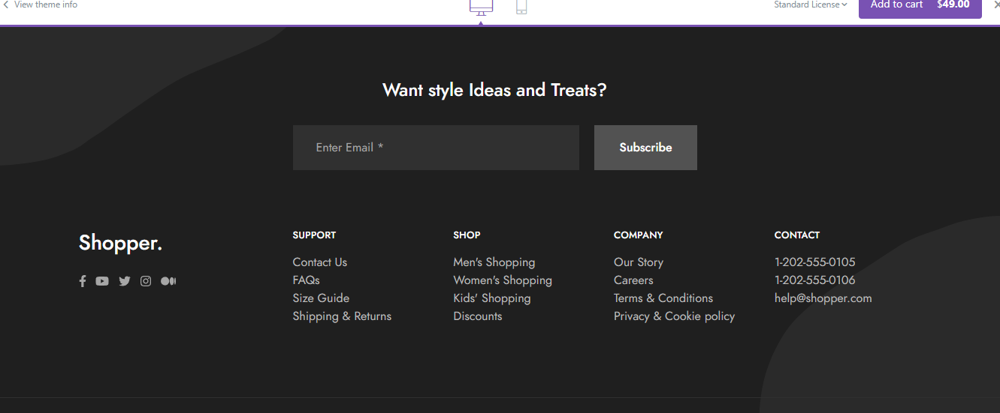
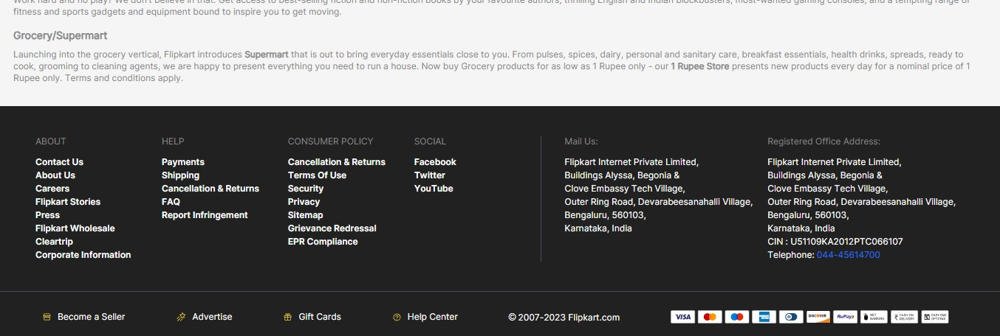
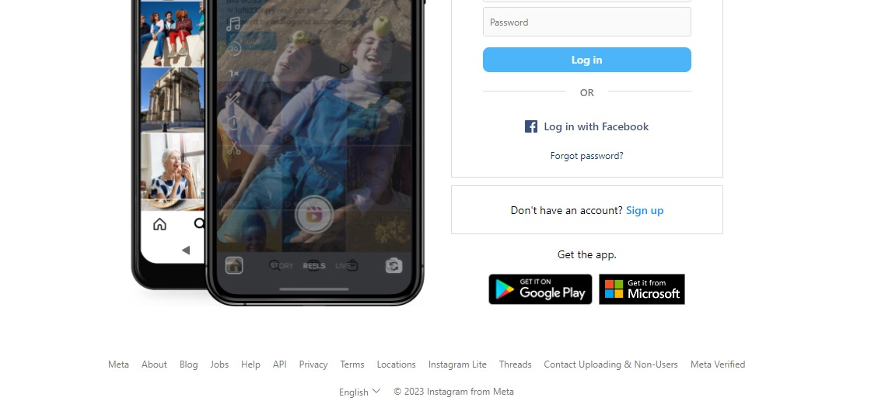

### Web dev Notes from Sudhakar Sharma - NareshIT

25th September 2023

### Nav

- It defines navigation area in webpage.
- Typically elements in Nav area are used to navigate from one location to another with in the page or outside side.

```
Syntax:
    <nav>
       ... your content ...
    </nav>
```

### Creating Responsive Navbar:

- A responsive navbar can change its orientation according device width.
- You can control the page orientation by using "CSS" media queries.

```
Syntax:
    @media  type  and (orientation:landscape|portrait) {

    }

    type = screen, print, speech
```

### CSS Flex:

- The default flex direction is "row".
- You can change the flex direction to "column".
- Direction is mostly controlled using "@media" query.

```
Syntax:
    nav {
      display:flex;
      flex-direction: row | column;
    }
```

### CSS Hover:

- Hover is a class of CSS that defines effects for element when mouse pointer is over - the element.
- Any CSS class can be configured for element by using ":" which is inheritance operator.

```
Syntax:
    element : className {

    }

    span:hover {

    }
```

### Example

```
<!DOCTYPE html>
<html lang="en">
<head>
    <meta charset="UTF-8">
    <meta name="viewport" content="width=device-width, initial-scale=1.0">
    <title>Navbar</title>
    <link rel="stylesheet" href="node_modules/bootstrap-icons/font/bootstrap-icons.css">
    <style>
        span {
            display: inline-block;
            width: 100px;
            border:1px solid black;
            text-align: center;
            font-family: Arial;
            font-size: 20px;
            padding: 5px;
        }

        span:hover {
            background-color: black;
            color:white;
            cursor: grab;
        }

        @media screen and (orientation:landscape) {
            nav {
                display: flex;
                flex-direction: row;
            }
            span {
                margin-right: 20px;
            }
        }
        @media screen and (orientation:portrait) {
            nav {
                display: flex;
                flex-direction: column;
            }
            span {
                margin-bottom: 20px;
            }
        }
    </style>
</head>
<body>
    <nav>
        <span class="bi bi-house"> Home</span>
        <span class="bi bi-file-break"> Pages</span>
        <span class="bi bi-cart"> Shop</span>
        <span class="bi bi-globe"> Blog</span>
        <span class="bi bi-search"> Search</span>
    </nav>
</body>
</html>
```

Summary

- Header
- Article
- Nav

### Section

- It defines the area between header and footer.
- Section comprises of body content, which includes all document elements and semantics displayed in workspace.

```
Syntax:
   <section>
    ... your content....
  </section>
```

### Main

- In computer programming and designing "main" refers to "entry point".
- Every website provides an entry point for new user.
- A website can have multiple entiry points.
- Typically main contains register link or navigation to the contents in page.

```
Syntax:
    <section>
       <main>
        ... entry point...
       </main>
    </section>
```

### CSS Transparent Color:

- You can set transparent color in css by using "rgba()" method.
- It uses "red, green, blue & alpha values".

       rgba(redValue, greenValue, blueValue, alphaValue)

- RGB value range will be from 0 to 255.
- Alpha value range can be 0 to 1.

      rgba(0,255,0, 0.5)        => transparent green
      rgba(0,0,0,0.5)        => transparent black

### Ex: Netflix

```
<!DOCTYPE html>
<html lang="en">
<head>
    <meta charset="UTF-8">
    <meta name="viewport" content="width=device-width, initial-scale=1.0">
    <title>Netflix</title>
    <link rel="stylesheet" href="node_modules/bootstrap-icons/font/bootstrap-icons.css">
    <style>
        body {
            background-size: cover;
        }
        .shade {
            background-color: rgba(0,0,0,0.7);
            width: 105%;
            height: 100vh;
            margin-top: -10px;
            margin-left: -10px;
        }
        header {
            padding: 40px;
            padding-right: 100px;
            color:white;
            display: flex;
            justify-content: space-between;
        }
        .brand-title {
            font-size: 30px;
            color:red;
            font-weight: bold;
            font-family: Arial;
        }
        .language {
            display: inline-block;
            padding: 5px;
            border:1px solid white;
            border-radius: 2px;
        }
        .signin {
            background-color: red;
            color:white;
            font-family: Arial;
            padding: 5px;
            display: inline-block;
            width: 80px;
            text-align: center;
            border-radius: 2px;
        }
        .title {
            font-size: 52px;
            font-weight: bold;
            font-family: Arial;
            text-align: center;
            color:white;
            width: 100%;
            margin-top: 120px;
        }
        .sub-title {
            color:white;
            font-size: 25px;
            font-family: Arial;
            text-align: center;
            margin-top: 30px;
        }
        section {
            padding-right: 60px;
        }
        main {
            text-align: center;
            color:white;
            margin-top: 20px;
        }
        .main-title {
            font-size: 20px;
            font-family: Arial;
            margin-bottom: 20px;
        }
        .email {
            display: inline-block;
            background-color: black;
            color:white;
            padding: 10px;
            width: 250px;
            border:1px solid white;
            text-align: left;
            font-size: 20px;
        }
        .btn-start {
            display: inline-block;
            background-color: red;
            color:white;
            font-size: 20px;
            font-weight: bold;
            padding: 10px;
            width: 160px;
        }
    </style>
</head>
<body background="public/images/netflix.jpg">
    <div class="shade">
        <header>
            <div>
                <span class="brand-title">NETFLIX</span>
            </div>
            <div>
                <span class="language">
                    <span class="bi bi-translate"></span>
                     English
                    <span class="bi bi-chevron-down"></span>
                </span>
                <span class="signin">
                    Signin
                </span>
            </div>
        </header>
        <section>
            <div class="title">The biggest Indian hits. Ready to watch here from ₹ 149.</div>
            <div class="sub-title">Join today. Cancel anytime.</div>
            <main>
                <div class="main-title">Ready to watch? Enter your email to create or restart your membership.</div>
                <div class="register">
                    <span class="email">Email Address</span>
                    <span class="btn-start">
                        Get Started <span class="bi bi-chevron-right"></span>
                    </span>
                </div>
            </main>
        </section>
    </div>
</body>
</html>
```

### Class 26/09/2023

### My Notes

Every Page width can be 1200px or 12fr. pixels (px) is not responsive but fraction(fr) is responsive.
e.g. if we divide page in 5 fractions, each fraction will be 12/5 = 2.4 fr

<'aside'> tag is used if the content like links or advertisement (not related to current page).

### Class Notes

Header
Section
Main
Nav
Article
Div
Span

### Footer

- Footer comprises of information displayed at bottom margin of page.
- Typically footer contains information about services, copyrights, address etc.
- Content in footer is used for SEO.

```
Syntax:
    <footer>
        ... your content...
    </footer>
```

### FAQ: How to keep content exactly center screen?

Ans: 1. Make sure that all the content that you want to keep in center is inside one
container.

                        <main>
                        <div>Title</div>
                        <div>Sub Title</div>
                        </main>

    2. Set following attributes for parent container, that holds the single fragment in
        page.
                        <section>
                            <main>
                            <div> Title </div>
                            <div> Sub Title </div>
                           </main>
                        </section>

        section {
            display:flex;
            justify-content:center;
            align-items:center;
            height:100vh;
         }

### CSS Box & Text Shadow

    box-shadow : horizontalPixles, verticalPixels, blurPixels, color;
    text-shadow : horizontalPixles, verticalPixels, blurPixels, color;

```
Syntax:
    .title {
        text-shadow : 5px 4px 2px black;
    }
```

### Example: ex_centering.html

```
Ex:
<!DOCTYPE html>
<html lang="en">
<head>
    <meta charset="UTF-8">
    <meta name="viewport" content="width=device-width, initial-scale=1.0">
    <title>Document</title>
    <style>
        .title {
            font-size: 100px;
            font-weight: bold;
            text-shadow: 5px 5px 5px yellow;
        }
        .sub-title {
            font-size: 25px;
            font-style: italic;
        }
        section {
            display: flex;
            justify-content: center;
            align-items: center;
            height: 100vh;
            text-align: center;
            background-color: rgba(0,0,0,0.7);
        }
        main {
            color:white;
        }
    </style>
</head>
<body background="public/images/banner.jpg">
    <section>
            <main>
            <div class="title">Fashion Store</div>
            <div class="sub-title">Men's Fashion | Kid's Fashion | Women's Fashion</div>
            </main>
    </section>
</body>
</html>
```

### CSS Grid Display:

- CSS Grid comprises of content arranged into fixed set of rows and columns.
- CSS Flex don't have fixed set of rows, it changes according to device width.
- Every page can split into 12 fractions for grid.
- You can define columns in fractions or in pixels [1200px].

```
Syntax:
    .container {
        display:grid;
        grid-template-columns: 6fr 6fr;    (or) 600px  600px
    }
```

### Aside

- Aside refers to content that is not relative to current context.
- It comprises of information that can take user aside from current location.
- Typically ads and social links are defined in aside.

```
Syntax:
    <aside>
        ... your content...
    </aside>

```



```
<!DOCTYPE html>
<html lang="en-in">
    <head>
        <title>Shopper Template</title>
        <meta name="viewport" content="width=device-width, initial-scale=1">
        <link rel="stylesheet" href="node_modules/bootstrap-icons/font/bootstrap-icons.css">
        <style>
            header {
                display: flex;
                justify-content: space-between;
                font-size: 20px;
                font-family: Arial;
                padding: 25px;
            }
            header span {
                margin-right: 25px;
            }
            .brand-title {
                font-size: 30px;
                font-weight: bold;
            }
            article {
                background-color: black;
                color:white;
                text-align: center;
                padding: 15px;
                font-size: 20px;
                font-family: Arial;
            }
            .bi-lightning-fill {
                color:gold;
            }
            nav span:hover {
                color:blue;
                cursor: grab;
                font-weight: bold;
            }
            section {
                height: 500px;
            }
            footer {
                background-color: black;
                color:white;
                padding: 10px;
            }
            .subscribe {
                display: flex;
                justify-content: center;
                align-items: center;
                height: 200px;
                text-align: center;
            }
            .subscribe-title {
                font-family: Arial;
                font-size: 25px;
                font-weight: bold;
                margin-bottom: 40px;
            }
            .email {
                display: inline-block;
                padding: 20px;
                width: 300px;
                font-size: 18px;
                border:1px solid white;
                text-align: left;
                background-color: gray;
            }
            .btn-subscribe {
                display: inline-block;
                padding: 20px;
                width: 100px;
                font-size: 18px;
                border:1px solid white;
                text-align: left;
                background-color: grey;
                font-weight: bold;
            }
            .footer {
                margin-top: 50px;
                display: grid;
                grid-template-columns: 2.4fr 2.4fr 2.4fr 2.4fr 2.4fr;
                font-family: Arial;
            }
            .footer-title {
                font-weight: bold;
                font-size: 18px;
                margin-bottom: 20px;
            }
            .footer-title~span {
                display: block;
                margin-bottom: 15px;
            }
            .footer-brand {
                font-size: 25px;
                font-weight: bold;
                margin-bottom: 20px;
            }
            aside span {
                font-size: 20px;
                margin-right: 10px;
            }
        </style>
    </head>
    <body>
        <header>
            <div>
                <span class="brand-title">Shopper.</span>
            </div>
            <div>
                <nav>
                    <span>Home</span>
                    <span>Catalog</span>
                    <span>Shop</span>
                    <span>Blog</span>
                    <span>Pages</span>
                    <span>Docs</span>
                </nav>
            </div>
            <div>
               <nav>
                <span class="bi bi-search"></span>
                <span class="bi bi-person"></span>
                <span class="bi bi-heart"></span>
                <span class="bi bi-cart4"></span>
               </nav>
            </div>
        </header>
        <article>
            <span class="bi bi-lightning-fill"></span>
            <span> HAPPY HOLIDAY DEALS ON EVERYTHING </span>
            <span class="bi bi-lightning-fill"></span>
        </article>
        <section>

        </section>
        <footer>
            <div class="subscribe">
                <div>
                    <div class="subscribe-title">Want style Ideas and Treats?</div>
                    <div>
                        <span class="email">Enter Email*</span>
                        <span class="btn-subscribe">Subscribe</span>
                    </div>
                </div>
            </div>
            <div class="footer">
                <div>
                    <div class="footer-brand">Shopper.</div>
                    <aside>
                        <span class="bi bi-facebook"></span>
                        <span class="bi bi-twitter"></span>
                        <span class="bi bi-instagram"></span>
                        <span class="bi bi-linkedin"></span>
                    </aside>
                </div>
                <div>
                    <div class="footer-title">SUPPORT</div>
                    <span>Contact Us</span>
                    <span>FAQs</span>
                    <span>Size Guide</span>
                    <span>Shipping & Returns</span>
                </div>
                <div>
                    <div class="footer-title">SHOP</div>
                    <span>Men's Shopping</span>
                    <span>Women's Shopping</span>
                    <span>Kids' Shopping</span>
                    <span>Discounts</span>
                </div>
                <div>
                    <div class="footer-title">COMPANY</div>
                    <span>Our Story</span>
                    <span>Careers</span>
                    <span>Terms & Conditions</span>
                    <span>Privacy & Cookie policy</span>
                </div>
                <div>
                    <div class="footer-title">CONTACT</div>
                    <span>1-202-555-0105</span>
                    <span>1-202-555-0106</span>
                    <span>help@shopper.com</span>
                </div>
            </div>
        </footer>
    </body>
</html>
```



### Example: Flipkart Footer Layout

```
<!DOCTYPE html>
<html lang="en">
<head>
    <meta charset="UTF-8">
    <meta name="viewport" content="width=device-width, initial-scale=1.0">
    <title>Document</title>
    <style>
        footer {
            padding: 10px;
            background-color: black;
            color:white;
            font-size: 20px;
            display: grid;
            grid-template-columns: 6fr 6fr;
            height: 300px;
        }
        .panel-left {
            display: grid;
            grid-template-columns: 3fr 3fr 3fr 3fr;
        }
        .panel-right {
            display: grid;
            grid-template-columns: 6fr 6fr;
            border-left: 1px solid white;
            padding-left: 20px;
        }
    </style>
</head>
<body>
    <footer>
        <div class="panel-left">
            <div>
                col-1
            </div>
            <div>
                col-2
            </div>
            <div>
                col-3
            </div>
            <div>
                col-4
            </div>
        </div>
        <div class="panel-right">
            <div>
                col-1
            </div>
            <div>
                col-2
            </div>
        </div>
    </footer>
</body>
</html>
```


Example: Instagram footer

```
<!DOCTYPE html>
<html lang="en">
<head>
    <meta charset="UTF-8">
    <meta name="viewport" content="width=device-width, initial-scale=1.0">
    <title>Document</title>
    <style>
        footer {
            padding: 20px;
            text-align: center;
            font-size: 15px;
            font-family: Arial;
        }
        footer span {
            margin-right: 20px;
        }
        footer div {
            margin-bottom: 20px;
        }
    </style>
</head>
<body>
    <footer>
        <div>
            <span>Meta</span>
            <span>About</span>
            <span>            Blog</span>
            <span>Jobs</span>
            <span>Help</span>
            <span>API</span>
            <span>Privacy</span>
            <span>Terms</span>
            <span>Locations</span>
            <span>Instagram Lite</span>
            <span>Threads</span>
            <span>Contact Uploading & Non-Users</span>
            <span>Meta Verified</span>
        </div>
        <div>
            <span>English</span>
            <span> &copy; 2023 Instagram from Meta</span>
        </div>

    </footer>
</body>
</html>
```

### Class 29/03/2023

### Text Formatting in HTML

```
<font>
<b> <strong>
<i> <em>
<strike> <del>
<u> <ins>
<sup>
<sub>
```

### Example : Text Formatting

```
<!DOCTYPE html>
<html lang="en">
<head>
    <meta charset="UTF-8">
    <meta name="viewport" content="width=device-width, initial-scale=1.0">
    <title>Document</title>
</head>
<body>
    The font style <b><strike><u>Bold</u></strike></b> is similar to <strong><del><ins>Strong</ins></del></strong>.
    <br>
    The font style <i>italics</i> is similar to <em>emphasized</em>.
    <br>
    5<sup>th</sup>
    <br>
    H<sub>2</sub>O
</body>
</html>
```

### Data List with Terms and Definitions

                    ------------------------------------------------

- Data list is defined with <dl>
- Terms are defined with <dt>
- Definitions with <dd>

```
Syntax:
    <dl>
        <dt> Term-1 </dt>
        <dd> Definition </dd>
    </dl>
```

```
Ex:
<!DOCTYPE html>
<html lang="en">
<head>
    <meta charset="UTF-8">
    <meta name="viewport" content="width=device-width, initial-scale=1.0">
    <title>Document</title>
    <link>
    <style>
       dt {
          background-color: lightgray;
          padding: 4px;
          width: 400px;
          font-weight: bold;
          margin-bottom: 5px;
       }
    </style>

</head>
<body>
     <dl>
        <dt>HTML</dt>
        <dd>It is a markup language. </dd>
        <dd>It is used for presentation.</dd>
        <dt>CSS</dt>
        <dt>Styles</dt>
        <dd>It defines styles.</dd>
        <dt>JavaScript</dt>
        <dd>It manipulates DOM.</dd>
     </dl>
</body>
</html>
```

### Data list is designed for columns, you can split the terms and definitions into columns by using "display:grid".

```
Syntax:
    dl {
        display:grid;
        grid-template-columns: 3fr 9fr;
     }
```

```
<!DOCTYPE html>
<html lang="en">
<head>
    <meta charset="UTF-8">
    <meta name="viewport" content="width=device-width, initial-scale=1.0">
    <title>Document</title>
    <link>
    <style>
       dt {
          background-color: lightgray;
          padding: 4px;
          font-weight: bold;
          margin-bottom: 5px;
       }
       dl {
          display: grid;
          grid-template-columns: 3fr 9fr;
       }
       dd {
         background-color: black;
         color:white;
         padding: 5px;
         margin-bottom: 5px;
       }
    </style>

</head>
<body>
     <dl>
        <dt>First Name</dt>
        <dd>some name</dd>
        <dt>Last Name</dt>
        <dd>some name</dd>
        <dt>Age</dt>
        <dd>22</dd>
        <dt>Email</dt>
        <dd>some email</dd>
    </dl>
</body>
</html>

```

### CSS Sticky Position:

- It keeps element exactly according to the normal flow of document.
- It can stick the element to page and lock scrolling after reaching specified point.

```
syntax:
    dt {
        position:sticky;
        top:0px;
    }
```

```
<!DOCTYPE html>
<html lang="en">
<head>
    <meta charset="UTF-8">
    <meta name="viewport" content="width=device-width, initial-scale=1.0">
    <title>Document</title>
    <link>
    <style>
        dt {
            font-weight: bold;
            padding: 4px;
            background-color: black;
            color:white;
            width: 200px;
        }
        dd {
            background-color: lightgray;
            margin-bottom: 4px;
            margin-top: 4px;
            width: 100px;
            padding: 4px;
        }
        dt {
            position: sticky;
            top: 0px;
        }
    </style>

</head>
<body>
    <nav>
        <dl>
            <h3>Shopper.</h3>
            <dt>Home</dt>
            <dd>Electronics</dd>
            <dd>Footwear</dd>
            <dd>Fashion</dd>
            <dt>Electronics</dt>
            <dd>Televisions</dd>
            <dd>Watches</dd>
            <dd>Mobiles</dd>
            <dd>Televisions</dd>
            <dd>Watches</dd>
            <dd>Mobiles</dd>
            <dd>Televisions</dd>
            <dd>Watches</dd>
            <dd>Mobiles</dd>
            <dd>Televisions</dd>
            <dd>Watches</dd>
            <dd>Mobiles</dd>
            <dd>Televisions</dd>
            <dd>Watches</dd>
            <dd>Mobiles</dd>
            <dt>Footwear</dt>
            <dd>Casuals</dd>
            <dd>Sneakers</dd>
            <dd>Boots</dd>
            <dd>Casuals</dd>
            <dd>Sneakers</dd>
            <dd>Boots</dd>
            <dd>Casuals</dd>
            <dd>Sneakers</dd>
            <dd>Boots</dd>
            <dd>Casuals</dd>
            <dd>Sneakers</dd>
            <dd>Boots</dd>
            <dd>Casuals</dd>
            <dd>Sneakers</dd>
            <dd>Boots</dd>
            <dd>Casuals</dd>
            <dd>Sneakers</dd>
            <dd>Boots</dd>
            <dd>Casuals</dd>
            <dd>Sneakers</dd>
            <dd>Boots</dd>
            <dd>Casuals</dd>
            <dd>Sneakers</dd>
            <dd>Boots</dd>
            <dd>Casuals</dd>
            <dd>Sneakers</dd>
            <dd>Boots</dd>
            <dt>Fashion</dt>
            <dd>Kids</dd>
            <dd>Women</dd>
            <dd>Men</dd>
            <dd>Kids</dd>
            <dd>Women</dd>
            <dd>Men</dd>
            <dd>Kids</dd>
            <dd>Women</dd>
            <dd>Men</dd>
            <dd>Kids</dd>
            <dd>Women</dd>
            <dd>Men</dd>
            <dd>Kids</dd>
            <dd>Women</dd>
            <dd>Men</dd>
            <dd>Kids</dd>
            <dd>Women</dd>
            <dd>Men</dd>
            <dd>Kids</dd>
            <dd>Women</dd>
            <dd>Men</dd>
            <dd>Kids</dd>
            <dd>Women</dd>
            <dd>Men</dd>
        </dl>
    </nav>
</body>
</html>
```

### Details & Summary

- Details is container with summary as caption.
- You can show or hide contents dynamically using details & summary.

```
Syntax:
    <details>
        <summary> Caption </summary>
        .... your content...
    </details>
```

### Example 1

```
<!DOCTYPE html>
<html lang="en">
<head>
    <meta charset="UTF-8">
    <meta name="viewport" content="width=device-width, initial-scale=1.0">
    <title>Document</title>
    <style>
        details div {
            margin-left: 50px;
            margin-bottom: 10px;
            margin-top: 5px;
            color:blue;
        }
        summary {
            color:blue;
        }
    </style>
</head>
<body>
    <details open>
        <summary>Need Help?</summary>
        <div>Forgot Password</div>
        <div>Other issues with sign-in</div>
    </details>
</body>
</html>
```

### Example 2

```
<!DOCTYPE html>
<html lang="en">
<head>
    <meta charset="UTF-8">
    <meta name="viewport" content="width=device-width, initial-scale=1.0">
    <title>Document</title>
    <style>
        details div {
            margin-left: 50px;
            margin-bottom: 10px;
            margin-top: 5px;
            color:blue;
            background-color: lightgray;
            padding: 4px;
            width: 120px;
        }
        summary {
            color:blue;
        }
    </style>
</head>
<body>
    <details open>
       <summary>Home</summary>
       <div>Electronics</div>
       <div>Footwear</div>
       <div>Fashion</div>
    </details>
    <details>
        <summary>Electronics</summary>
        <div>Televisions</div>
        <div>Mobiles</div>
        <div>Watches</div>
    </details>
    <details>
        <summary>Footwear</summary>
        <div>Casuals</div>
        <div>Sneakers</div>
        <div>Boots</div>
    </details>
</body>
</html>
```

### Fieldset & Legend

- Fieldset is a container used to display a category or group of contents in page.
- Legend defines the container title.

```
Syntax:
    <fieldset>
        <legend> Title </legend>
        .... your content...
    </fieldset>
```


### Notes for 03/10/2023

### Image Attributes
1. src
2. alt
3. title
4. width
5. height
6. border
7. align
8. hspace
9. vspace

### Advanced Attributes

10. crossorign        :  It configures CORS [cross origin resource sharing] for image.
                   If any image is rendered from remote server, then it requires
                   CORS configuration.
```
Syntax:
    
```

11. decoding        : It defines how image have to load along with other contents in
                  page. It have values "sync, async & auto".
```
Syntax:
    

```

12.  importance    : It sets priority for image, which can be low, medium, high & auto.
```
Syntax:
    
```

13.  srcset        : It defines a collection of images to display at specific embedded
                 position.
```
Syntax:
    
```

FAQ's: How to design fluid-images?
Ans: You can configure fluid image by defining the size in "%".

                Static
                Fluid


        